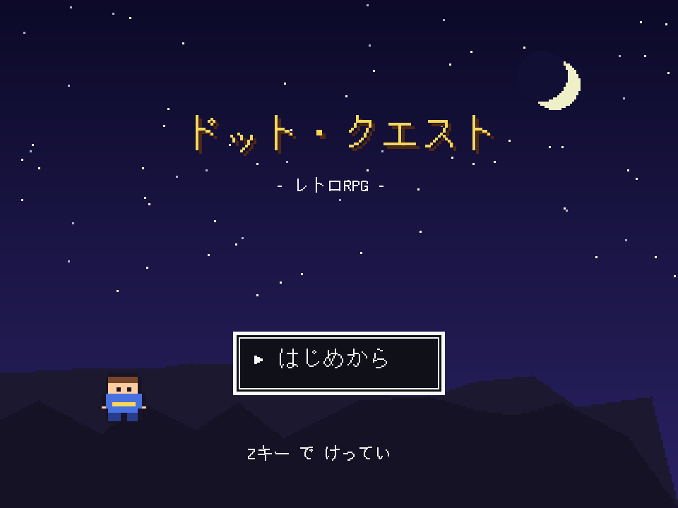
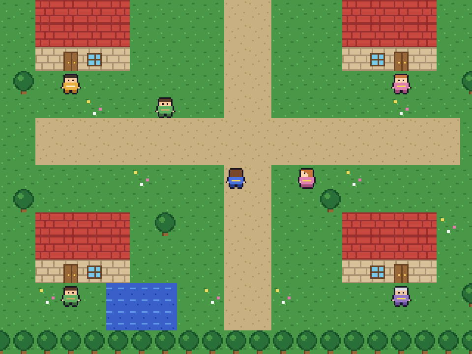
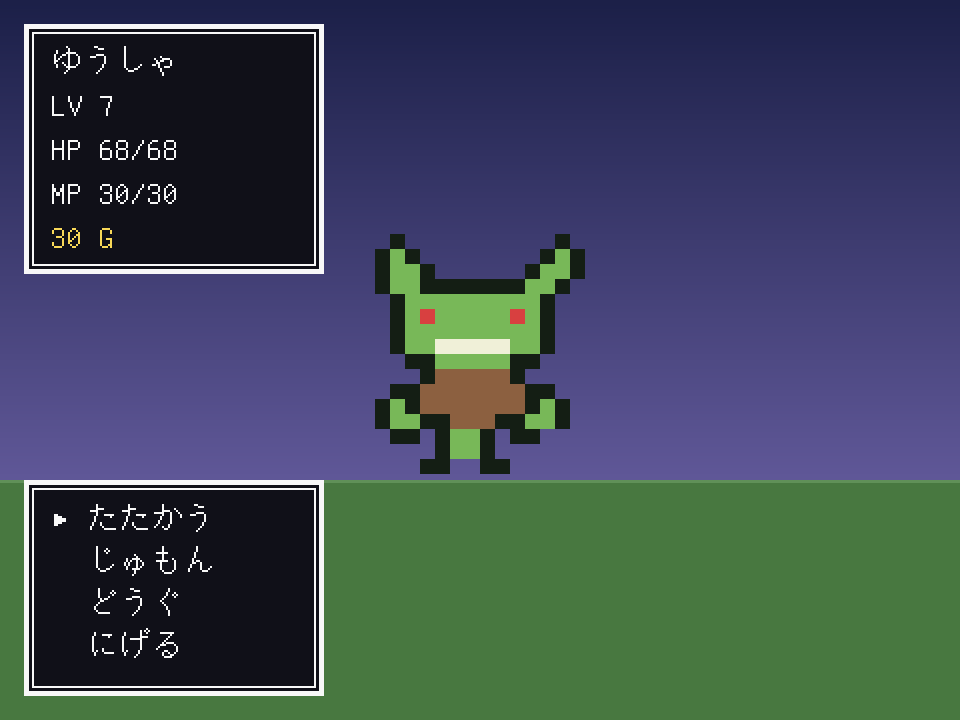

# ドット・クエスト — Python で つくる レトロRPG

ファミコン風の 1人旅 RPG。Python + Pygame だけで うごきます。
画像ファイルも 音声ファイルも 使っていません。
ドット絵は 文字の ならびから、効果音は 矩形波から、その場で つくっています。

<p>
  
  
  
</p>

## あそびかた

```bash
pip install -r requirements.txt
python main.py
```

| キー | できること |
|------|-----------|
| やじるしキー | あるく |
| Z / Enter / Space | はなす・けってい |
| X / Esc | メニュー・キャンセル |

## ゲームの ながれ

1. **はじまりのむら** — ちょうろうに はなしかけて クエストを うける
2. **どうぐや** で やくそうを かい、**やどや** で HP/MP を かいふく
3. **そうげん** の くさむらで レベルを あげる（ランダムエンカウント）
4. きたの **まおうの どうくつ** へ
5. おくの **まおう** を たおすと エンディング

しんでも ゲームオーバーで おわりません。ゴールドが はんぶんに なって
むらで めをさまします（ドラクエ方式）。
セーブは メニューの「セーブ」から。

## ファイル構成

```
retro-rpg/
├── main.py              起動するところ
├── rpg/
│   ├── config.py        画面サイズ・色などの ていすう
│   ├── game.py          ゲームループ と シーン管理
│   ├── scenes.py        タイトル / ゲームオーバー / エンディング
│   ├── field.py         マップを あるく がめん
│   ├── battle.py        ターン制の たたかい
│   ├── menus.py         メニュー・どうぐや・やどや
│   ├── ui.py            ウィンドウ・メッセージ・コマンド選択
│   ├── maps.py          マップの データ（1文字 = 1マス）
│   ├── tiles.py         地形タイルの 絵
│   ├── sprites.py       キャラと モンスターの ドット絵
│   ├── data.py          レベル表・じゅもん・どうぐ・モンスター
│   ├── party.py         主人公の ステータスと セーブ
│   └── sfx.py           矩形波で つくる 効果音
└── tools/
    ├── selftest.py      画面なしで 通しプレイして 動作確認
    └── screenshots.py   各シーンを PNG に 保存
```

## しくみの ポイント

**低解像度で描いて 拡大する**
マップは 320×240 の 小さい画面に 描いてから 3倍に 拡大しています
(`config.py` の `LOGICAL_W` / `SCALE`)。これで ドットが カクカクした
レトロな 見ために なります。文字だけは 拡大後の 画面に 直接 描くので 読みやすいまま。

**ドット絵は 文字で 持つ**
`sprites.py` の絵は こんな 見ためです。`.` が とうめい、
ほかの 文字は パレットの 色に なります。書きかえれば すぐ 絵が かわります。

```python
"....oooooooo....",
"...ohhhhhhhho...",   # h = かみ
"...osssssssso...",   # s = はだ
"...ossossosso...",   # o = くろ（め）
```

**たたかいの ながれは ジェネレータ**
`battle.py` の `_turn()` は `yield` で とまります。
「メッセージを 読みおわるまで まつ」を これで 表しているので、
コールバックだらけに ならずに 順番どおり 書けます。

## じぶんで かえてみる

- **むずかしさ** … `data.py` の `LEVELS` と `MONSTERS` の 数字
- **じゅもん・どうぐ** … `data.py` の `SPELLS` / `ITEMS` に 足すだけ
- **マップ** … `maps.py` の 文字を 書きかえる（記号の意味は `tiles.py`）
- **キャラの 見ため** … `sprites.py` の 文字の 絵と `PALETTES` の 色
- **エンカウント率** … `maps.py` の `encounter` の `rate`（小さいほど よく出る）

## 動作確認

```bash
python tools/selftest.py     # 画面なしで 通しプレイ（21項目）
python tools/screenshots.py  # 各シーンの PNG を 出力
```

`selftest.py` は タイトル → 会話 → 買いもの → 宿屋 → 戦闘 → レベルアップ →
セーブ/ロード → ゲームオーバー → ボス戦 → エンディング までを
じっさいに うごかして たしかめます。
